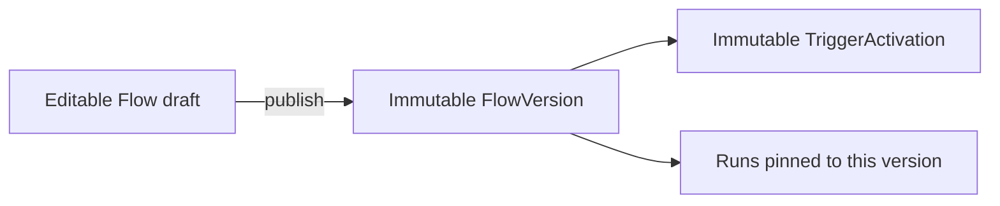

# Flows and versions

> **Experimental:** Nodeflow is pre-release software. Test flow changes and side effects before production use.

A `Flow` is the editable container. Publishing creates an immutable `FlowVersion` graph and an immutable `TriggerActivation` routing snapshot. Every run remains pinned to its own version even after another publication.



## Draft concurrency

`draft_graph` may be incomplete; draft saves perform structural checks, not full publication validation. `draft_updated_at` is display metadata. `draft_revision` is the monotonic compare-and-swap token: it increments on each accepted save and is not reset by publication.

```php
public function save(Flow $flow, array $graph, ?int $lastSeenRevision): int
```

A stale save throws `StaleDraftException`, which exposes the winning `graph()` and `revision()`. A `null` revision means zero; it is not an override.

## Create a flow safely

Models allow mass assignment, so the host must own structural identifiers and authorization. Tenant identity is supplied by `TenantResolver`; never accept it, a version ID, or a parent foreign key directly from request data.

```php
use Illuminate\Support\Facades\DB;
use Illuminate\Support\Facades\Gate;
use Nodeflow\Editor\SaveDraft;
use Nodeflow\Models\Flow;

[$flow, $revision] = DB::transaction(function () use ($graph): array {
    Gate::authorize('nodeflow.createFlow');

    $flow = Flow::create([
        'name' => 'Renewal reminder',
        'status' => 'draft',
    ]);

    Gate::authorize('update', $flow);
    $revision = app(SaveDraft::class)->save($flow, $graph, null);

    return [$flow, $revision];
});
```

## Publish immutable routing

`PublishFlow::publish()` validates the graph, locks the trusted flow row, verifies `expectedDraftRevision`, creates the next numbered version, compiles one activation, updates `current_version_id`, marks the flow `active`, and clears the saved draft in one transaction.

```php
$result = app(\Nodeflow\Publishing\PublishFlow::class)->publish(
    $flow,
    $graph,
    publishedBy: (string) auth()->id(),
    expectedDraftRevision: $revision,
);
```

The activation stores driver, source, optional qualifier, trigger node ID, descriptor metadata, tenant, flow, and exact version. A later occurrence uses that immutable snapshot; a later publish replaces the flow's one current activation but does not rewrite old versions or existing runs.

For a webhook activation, first publication also creates a stable endpoint token and encrypted signing secret. `PublishResult::$webhookUrl` is null if the host did not mount a resolvable public route. `PublishResult::$webhookSecret` is plaintext only for credential creation; later publications return null. Rotation is the only supported way to replace the secret.

`content_hash` is `hash('sha256', json_encode($graph))`. It detects the exact stored encoding, not semantic graph equality, and does not deduplicate publications.

## Graph publication rules

Publication requires exactly one trigger node, with `graph.start` pointing to it, no incoming edges, and exactly one `started` edge to an executable node. It also validates every registered node definition, selected allowlisted source, driver descriptor, edge output, cycle, and single-target output rule. Publishing compiles source routing data once; trigger runtime revalidates that pinned representation before extension code runs.

The editor supports replacing the single trigger with another server-palette trigger. It does not add a second trigger. If a driver has no registered source, authors see an empty state and cannot publish a made-up source.

## Immutability and foreign-key discipline

Package services never mutate published graphs. `FlowVersion` prevents moving `flow_id` through event-firing model writes, and `TriggerActivation` prevents all routing-field updates; publication replaces the activation row. Database/query-builder writes can bypass model events, so host code must not mutate or delete versions/activations used by live runs.

`Flow.current_version_id`, `FlowVersion.flow_id`, `TriggerActivation.flow_id`, `TriggerActivation.flow_version_id`, and `Run.flow_version_id` are structural package-owned references. Their Eloquent guards verify parent, tenant, and flow/version consistency. Do not accept these identifiers from authors or request input.

Next, define executable capabilities in [Writing nodes](writing-nodes.md), or review run origins in [Starting runs](starting-runs.md).
