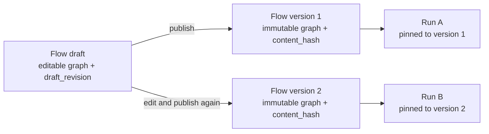

# Flows and versions

> **Experimental:** Nodeflow is pre-release software. Test flows and their side effects carefully before relying on them in production.

A flow is the editable container for an automation. Publishing creates an immutable version of its graph; a run is pinned to that version for its entire lifetime.



The flow records the latest published version in `current_version_id`. A run stores its own `flow_version_id`, not `current_version_id`; publishing version 2 therefore does not change a run that is waiting or already executing version 1. Older versions must remain available for those runs. Never edit a published graph in place—make a new draft and publish a new version instead.

## Work with drafts

`draft_graph` is deliberately separate from a flow version. It may contain a partially connected or otherwise unpublishable graph so that autosave can preserve work in progress. `draft_updated_at` is display information, not a concurrency token.

The concurrency token is the integer `draft_revision`. It starts at zero, increases by one for every accepted save, and is never reset, including after publishing. A client sends the revision it last received; `SaveDraft` compares it atomically with the stored revision. If it is stale, the save is refused with `StaleDraftException`, which carries the winning `graph()` and `revision()`.

The current service signature is:

```php
public function save(Flow $flow, array $graph, ?int $lastSeenRevision): int
```

It returns the new revision. A `null` last-seen revision means revision zero; it does not bypass the check. See [Editor](../editor-and-run-view/editor.md) for the autosave request and conflict response contract.

## Create and save without trusting identifiers

The models allow mass assignment, so application code must set structural identifiers itself. Do not accept `tenant_id`, `current_version_id`, a version ID, `flow_id`, or a version's `flow_id` from request input. Authorize creation and each direct mutation in the host application.

```php
<?php

namespace App\Http\Controllers;

use Illuminate\Http\JsonResponse;
use Illuminate\Http\Request;
use Illuminate\Support\Facades\Gate;
use Nodeflow\Editor\SaveDraft;
use Nodeflow\Models\Flow;

class FlowController
{
    public function store(Request $request): JsonResponse
    {
        $data = $request->validate([
            'name' => ['required', 'string'],
            'graph' => ['required', 'array'],
            'draft_revision' => ['nullable', 'integer'],
        ]);

        // This is an application-defined ability for creating flows.
        Gate::authorize('nodeflow.createFlow');

        $flow = Flow::create([
            'name' => (string) $data['name'],
            'trigger_type' => 'manual',
            'trigger_config' => [],
            'status' => 'draft',
        ]);

        // For an existing, tenant-scoped flow, use the supplied per-flow policy.
        Gate::authorize('update', $flow);

        $revision = app(SaveDraft::class)->save(
            $flow,
            $data['graph'],
            $data['draft_revision'] ?? null,
        );

        return response()->json(['id' => $flow->id, 'draft_revision' => $revision], 201);
    }
}
```

The tenant trait supplies the new flow's tenant from the trusted request context. Publishing derives the version's `flow_id` and `tenant_id` from this authorized flow, then alone updates `current_version_id`.

## Publish snapshots, not edits

Each publish creates the next per-flow integer version and stores the submitted graph. `content_hash` is the SHA-256 hash of that graph's JSON encoding; equal submitted graph arrays produce the same hash even when they are published as separate versions. It identifies the stored content; it does not deduplicate versions.

Publishing is transactional: Nodeflow creates the `FlowVersion`, points `current_version_id` at it, marks the flow active, and clears `draft_graph` and `draft_updated_at` together. It intentionally leaves `draft_revision` unchanged so an editor that remains open can continue from its current token without reusing an old revision.

## Next step

Build the reusable capabilities that graphs reference in [Writing nodes](writing-nodes.md).
