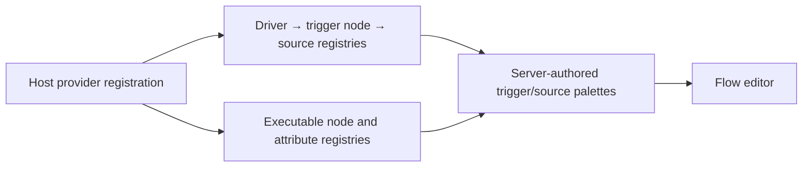
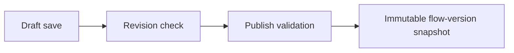
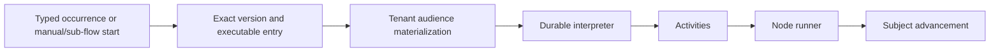

# Architecture

Nodeflow separates authoring, execution, and inspection so a Laravel application can supply domain behavior while the package manages workflow mechanics. This page maps the boundaries and the paths between them.

## Outcome

After reading this page, you can choose the right subsystem for a change without moving domain side effects into replayed workflow code or coupling the run view to the editor.

## Major boundaries

| Area | Responsibility |
| --- | --- |
| Registration | Laravel service providers register executable nodes, trigger drivers, trigger nodes, allowlisted trigger sources, and subject attributes with singleton registries. |
| Authoring | The editor receives server-authored palettes, saves an intentionally incomplete draft, and asks the server to publish a valid graph. |
| Publishing | Graph validation creates a numbered flow-version plus immutable compiled trigger activation and updates the flow's current version. |
| Starts and audiences | Webhook, model, Laravel-event, manual, and sub-flow starts select an exact published version/entry, materialize an authorized audience, and create a durable run. |
| Execution | The interpreter owns deterministic control flow; activities and the node runner read and write application state. |
| Inspection | Run records become a read-only overlay and a cursor-paginated subject drill-down for the run's pinned graph. |

The public integration surface is registration, including the registry registration and node-alias operations, the contracts, the flow and run services, and the React exports. Palette serialization, renderer behavior, and undocumented registry mechanics remain implementation details, along with the graph, execution, workflow, and view-model internals. See [Project structure](project-structure.md) for the corresponding directories.

## From registration to the editor

Executable and trigger node classes are registered with separate registries backed by one graph-type catalog. Trigger drivers own occurrence transport; trigger sources are explicit host allowlists. Registries resolve definitions into server-authored executable, trigger, and compatible-source palettes. Subject attributes follow the same pattern for condition-field options.

The editor is a client for these server-authored contracts. It does not decide which PHP classes are executable. Keep validation and registration rules on the server, and add a client control or renderer only as presentation for an already registered definition. The full integration boundary is described in [Registering domain components](../integration/registering-domain-components.md).

## Drafts become immutable versions

A draft is working state, not an execution artifact. The editor saves its graph together with the draft revision it last saw. A stale revision is refused instead of silently overwriting another editor's save. Draft saves allow a half-finished graph; publish is the point at which graph semantics are checked.

On a successful publish, the package creates the next numbered version, compiles exactly one immutable activation, makes the version current, and clears the saved draft. The activation carries tenant, driver, source, qualifier, trigger node, descriptor, and exact version. Runs and already-captured occurrences retain their version reference, so a later publish cannot move them. See [Flows and versions](../building-automations/flows-and-versions.md) and [Publishing flows](../building-automations/publishing-flows.md) for the API and validation contract.

## Starts become durable execution

A built-in/custom driver wraps input in a typed occurrence. The shared dispatcher validates pinned activation state before extension code, resolves a tenant `TriggerMatch`, and calls the trigger run starter. Manual and sub-flow starts bypass matching but still skip the declarative graph trigger to its executable `started` target. Every path checks and materializes the audience before durable dispatch.

The interpreter is deliberately deterministic: it owns graph traversal and waits, but performs no database, HTTP, clock, or other side-effecting work itself. Durable engines may replay workflow code, so non-deterministic reads and effects there could run differently or more than once. Activities form the bridge into ordinary Laravel code; the node runner invokes subject or audience nodes and advances subject records according to each node result.

Run creation persists `started_via`, `trigger_node_id`, source-controlled `trigger_data`, exact `engine_entry_node_id`, and dispatch state with the audience. Engine dispatch waits for an outer transaction commit, uses a deterministic workflow identity, and can recover a failed start without creating another run. Trigger nodes never enter the interpreter.

Put domain effects in node implementations, reached through activities, and make those effects safe for the delivery and retry semantics your host requires. Learn the execution model in [Durable execution](../operations/durable-execution.md) and the node contracts in [Writing nodes](../building-automations/writing-nodes.md).

## Records become a run view

The run view reads the graph pinned to the run's flow version. The server derives an overlay from execution records and active subjects, then the client renders that overlay on the graph. Selecting a node requests only the active subjects currently at that node; it is not a complete history endpoint.

The run client has no editor import. It is intentionally read-only, has no autosave or publish request, and does not need authoring state. Keeping the clients separate avoids pulling editor behavior into an operational screen and prevents an inspection view from implying it can change the executing graph. See [Inspecting runs](../editor-and-run-view/inspecting-runs.md).

## Next step

Set up the package workspace with [Local development](local-development.md).
