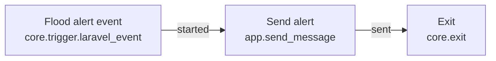

# Flood-alert example application

> **Experimental:** Nodeflow is pre-release software. Treat this walkthrough as a starting point, review the package's current behavior, and test the application-owned side effects before using it for real alerts.

This illustrative walkthrough builds a tenant-aware flood-alert journey. `Organization` is the tenant, `User` is the subject, and the application owns both message records and message delivery. Nodeflow owns the graph, durable waits, version pinning, and run routing.

This documentation provides code examples only; no downloadable or hosted demo application is provided.

The journey is deliberately small:

In words: **Flood alert event → send alert → exit.** The graph uses the built-in `core.trigger.laravel_event` node with allowlisted source `flood.alert_dispatched`, executable node type `app.send_message`, and `core.exit`. The host event snapshot supplies tenant audiences and alert data.

## What this teaches

You will define the host models and resolvers, turn `FloodAlertDispatched` into tenant-specific audiences through a `LaravelEventTriggerSource`, register a safe message node, publish a trigger-first graph, and test its important boundaries. The example assumes that every `User` belongs to exactly one `Organization`, that an alert already identifies affected users by organization, and that the event is dispatched only after the alert has been recorded and committed.

Messaging is intentionally host-owned. `DemoMessage` is an application record used here to stand in for a real delivery service; the node's idempotency key and test-mode branch are the same boundaries a notification, email, SMS, or API integration needs. Nodeflow does not create `Organization`, `User`, `FloodAlert`, or `DemoMessage` tables, and it does not decide who may send messages.

An alert can include users from more than one organization. The trigger returns one audience per organization, and Nodeflow starts one run for each matching active flow in each tenant. It is therefore incorrect to assume one dispatched event always produces one run.

## Page map

- [Application setup](application-setup.md) establishes host data, tenancy, registration, authorization, and routes.
- [Flood-alert workflow](flood-alert-workflow.md) implements the allowlisted event source, trigger-first graph, publishing, and dispatch.
- [Testing the workflow](testing-the-workflow.md) supplies focused Pest tests for the application boundary and package behavior.

## Next step

Set up the host-owned data and contracts in [Application setup](application-setup.md).
