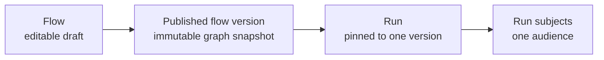

# Core concepts

This page gives you the mental model needed to design a flow, publish it safely, and understand what a durable run records.

## Flow, version, run, and subjects

A **flow** is the editable definition of an automation. Its draft can change while authors work.

A **flow version** is the immutable snapshot created when the flow is published. It contains the graph: its nodes, edges, and node configuration. A **run** is one execution of one published version. It pins that version, so later edits and later publications never alter an in-progress run.

Each run has one **audience**: the set of subject IDs supplied when it starts. The runtime stores that audience as run-subject records. A **subject** is one member of the audience, identified by a subject type and ID supplied by your application.

In prose: authors edit a flow, publishing creates a separate immutable version, a run selects exactly one version, and that run materializes exactly one audience of subjects. The run does not switch to a newer version halfway through.

## Nodes and edges

A **node** is a registered capability in the graph. It declares a stable type such as `app.send_message`, its author-facing fields, and its named outputs. Nodeflow's built-in nodes use the `core.` namespace.

An **edge** connects one named output to the next node. For example, an `app.send_welcome` node can route its `sent` output to `core.exit`. A graph has one `start` field that names its first ordinary node and must be valid before it can be published.

Subject nodes are written as single-subject code: they receive one resolved subject and return its next output. Nodeflow applies that same code across the run's audience. Audience nodes instead receive a cohort at once when batching makes sense.

## Cohorts and waits

Runs can use the `subject` or `cohort` strategy. A cohort run still retains individual subject state, but a wait is relative to the cohort's journey through the graph. When `core.wait` resumes, subjects that exited while waiting do not continue.

This makes a wait suitable for a shared journey such as “send the next update in one day,” not for an independent timer per user that should begin at unrelated times. Start separate runs when independent timing is the intended behavior.

## Triggers and fields

A **trigger** connects a host-application event to a flow start. Your application registers it, matches the event, determines the tenant and audience, and starts the run. Nodeflow does not invent domain events or audiences.

A node **field** is an author-facing configuration value, such as a wait duration or a selected subject attribute. Fields describe the editor control and server-side validation for a node configuration. They are part of the graph snapshot once published.

## String subject types and IDs

Nodeflow intentionally treats subject types and IDs as strings. This permits your application to use `user`, `contact`, or another stable subject code, and it avoids coupling the workflow engine to a particular Eloquent model or primary-key type.

Return subject maps keyed by the string form of each ID from `SubjectResolver`. Use the same subject type and ID representation when starting the run and when checking tenant ownership; otherwise a valid subject can fail to resolve during execution.

## Next step

Build the first integration in [Quick start](quick-start.md), then read [Flows and versions](../building-automations/flows-and-versions.md) for the complete publishing model.
