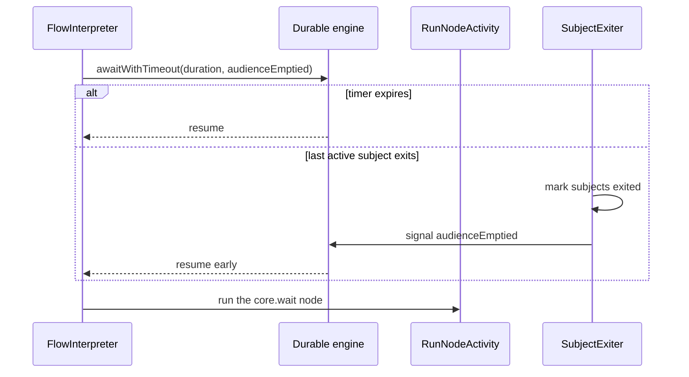

# Durable execution

Nodeflow runs a published graph as a durable workflow. Keep the workflow definition deterministic; put database access, node execution, HTTP calls, and every other side effect in activities or nodes.

> **Experimental:** Nodeflow is pre-release software. Treat durable workflow history as operational state, test upgrades against representative histories, and review [known limitations](../experimental/known-limitations.md) before relying on a workflow shape for a business-critical deadline.

## Keep workflow code deterministic

`FlowInterpreter` is workflow control flow only. It loads the graph through an activity, translates steps to durable-workflow calls, and completes the run through an activity. Workflow code must not read the database, make HTTP requests, read the clock, or perform other nondeterministic work: the durable engine can replay it after a worker restart.

`LoadGraphActivity` loads the run's `flow_version` and marks the run `running`. That version is immutable for the run: publishing a later version does not change the graph being executed. `RunNodeActivity` increments `steps_taken`, then delegates side effects and subject movement to `NodeRunner`. `CompleteRunActivity` writes `completed` and `ended_at`.

Node authors should keep all externally visible work in `HandlesSubject::forSubject()` or `HandlesAudience::forAudience()`, make it idempotent, and use the contexts' routing methods to return a deterministic result. See [Writing nodes](../building-automations/writing-nodes.md).

## Follow the cursor

`InterpreterLoop` begins with the persisted `engine_entry_node_id`: the executable target of the declarative trigger node's one `started` edge. It never executes the trigger node. For each cursor node it emits a `RunNodeStep`; a `core.wait` emits a `WaitStep` immediately before its node step. The node activity returns the IDs of target nodes that now contain subjects. The next cursor is the merged target list with duplicate node IDs removed.

That deduplication means a convergent branch executes the shared node once per cursor round, even if two outputs point to it. Subjects are still advanced by the node runner; the interpreter only deduplicates the node work item.

The loop is sequential. If two branches each reach a wait, their waits do not overlap: the later cursor item starts waiting only after the earlier one resumes. This is an intentional current limitation, not a worker-capacity setting; see [known limitations](../experimental/known-limitations.md).

## Limits and chunking

`StartRun` passes `nodeflow.limits.max_steps_per_run` to the interpreter. Its configured default is **1000**. The loop executes at most that many `RunNodeStep`s, including a wait node's subsequent node step; it stops without an error when the limit is reached, then the workflow completes the run. `steps_taken` increments once per node activity, so it records node attempts, not `WaitStep`s.

`NodeRunner` reads active subjects at the current node with `chunkById`, which remains safe if a node exits a subject during processing. The default chunk sizes are:

| Work type | Setting | Default |
| --- | --- | --- |
| Subject node | `nodeflow.limits.subject_chunk` | 500 subjects |
| Audience node | `nodeflow.limits.audience_chunk` | 5000 subjects |
| Run-subject view page | `nodeflow.limits.subject_page` | 50 subjects |

Run-audience admission is separately bounded by `nodeflow.limits.materialise_chunk` (default `1000`): ownership and inserts happen per materialization batch. For six-figure audiences, make the concrete resolver bound under `TenantResolver::class` implement `BatchTenantResolver`; a separate batch-only binding is not used by the runtime. See [Required contracts](../integration/required-contracts.md).

An audience node is preferred when a class implements both audience and subject interfaces. It receives one audience chunk at a time. A subject node resolves and invokes each subject in its chunk individually. Do not assume one audience node invocation represents the whole run.

## Wait and resume safely

Every `core.wait` races its configured duration against the `audienceEmptied` signal. `SubjectExiter` changes matching active subject rows to `exited`, clears their node cursor, and sends that signal only when the run has no active subjects and its status is one of `pending`, `running`, `waiting`, or `blocked`.

The signal is cohort-relative: exiting one subject from a larger audience does not wake the wait. A cohort of one wakes when that subject exits because the audience is then empty. Late exits against a terminal run do not signal the engine.

There is no persisted “signal already sent” marker. A duplicate or concurrent exit request that also observes zero active subjects can send `audienceEmptied` again. Serialize or de-duplicate exit requests in the host application when a surrounding integration needs one notification exactly once.

Cancelling a subject is not a workflow-wide cancellation. It removes that subject from its current cursor; remaining subjects keep progressing. The engine facade also has `cancel()`, but Nodeflow does not expose a run-level cancellation service or promise a run-status transition for it.

## Replay, retry, failure, and deploy safety

On a restart, the durable engine replays `FlowInterpreter` history and re-runs only deterministic control flow. Its activity boundaries keep Nodeflow database writes and node side effects outside that replayed workflow code. Preserve the `FlowInterpreter` class and registered node types required by live versions when deploying; check them before workers take work with [Health checks](health-checks.md).

Each `RunNodeActivity` is one logical durable activity. Its retry count, backoff, timeout, and non-retryable error names are frozen when the graph is published and persisted with the activity execution. A retry may repeat the activity body after an externally visible action has already succeeded but before the activity recorded completion. Give every external action a deterministic idempotency key derived from stable run, node, and subject/chunk identity.

The normal interpreter writes Nodeflow run status `pending` → `running` → `completed`. A terminal durable `WorkflowFailed` for `FlowInterpreter` is projected by a queued, after-commit listener: it atomically marks the Nodeflow run `failed`, records the bounded run error and durable event time in `ended_at`, and marks any still-active subjects failed while clearing their cursors. That projection job retries transient failures.

This is deliberately not an atomic outbox. If broker publication of the after-commit listener fails after the durable transaction commits, the durable failure may not reach Nodeflow until queue/runtime operations or a future reconciliation process repairs it. Monitor durable failures and queued projection jobs together, and include reconciliation in the operational roadmap before relying on failure status for a deadline.

For an already failed engine execution, inspect its durable history, current engine state, and `workflow:v2:doctor` output after fixing the root cause. Then use an application-defined repair process, or start a safe new idempotent run when the business operation permits it. Do not invent a generic resume command or mark the Nodeflow run complete by hand.

The pinned durable-workflow dependency also provides history export and replay-verification commands for its own workflow histories. Those commands are engine operations, not Nodeflow graph validation; use the dependency's installed command help before including them in a release gate.

## Next step

Run workers and verify their durable storage with [Queues and workers](queues-and-workers.md).
